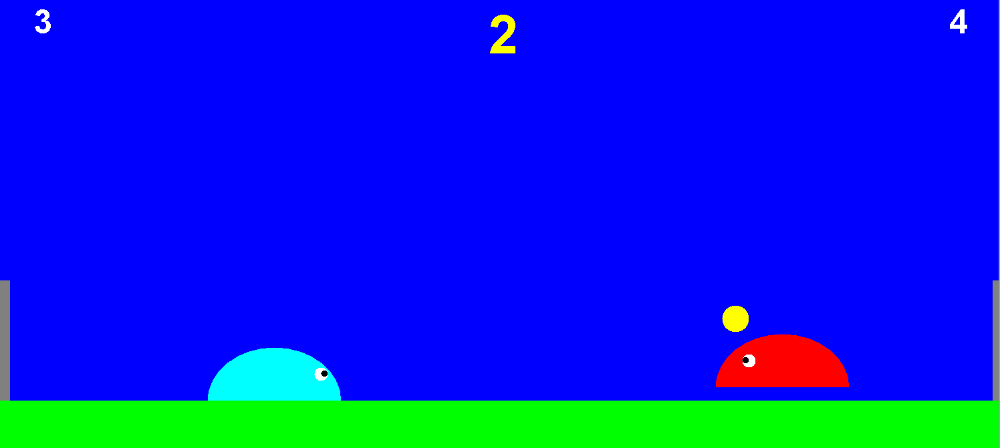

# SlimeSoccer
Remake of Slime Soccer in Java

## Overview
This is a remake of an online game called Slime Soccer that I used to play as a kid. The goal is to have a higher score than your opponent
at the end of a 60 second round. To score the ball must go in the goal on the side of your opponent's slime. WASD keys control the left player
and the arrow keys control the right player. Holding Down or S will cause the slime to hold the ball which can then be shot by jumping with
W or Up or by releasing the ball.

To run this program, just compile the java files and run the Board class.
